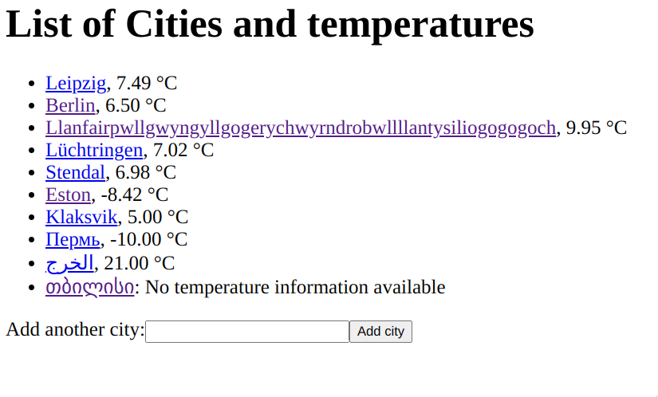

# Cities Frontend
This is the best City temperature tracker in the world.

## Usage
* By default, the application displays a list of 10 Cities in the world, plus the current temperature.
* Additional cities can be added by name.

## Architecture
This web application is implemented via Angular 10. The `CityComponent` displays the City’s name and
temperature, while the main `AppComponent` displays a list of all cities and the input field for
adding other entries to the list.

The data is retrieved by the `CityService`, which issue a `GET` request to the backend server upon
start. If a new City is added, the service sends a `PUT` request and the result is added to the list.

## Know problems
* If a City is already in the list and the user adds it again, the backend server will not store the city twice. However, it still will return the city’s data, which might cause this web app to add the city to the list, resulting in a duplicated entry. This should be gone after refreshing the page though.
* There is no error handling implemented at the moment, which means if the backend service goes away the user will not retrieve any useful error message.

## Ideas
* Something like bootstrap could be added to the website, so it does not look like a 1993‘s webpage.
* A delete button next to each city name could be added.
* If more weather data would be made available by the backend server, little emojis could be used to indicate the current weather ⛅🌧.
* A link to `wttr.in` could be added to retrieve the complete report.
* The input field could support some kind of auto-completion for city names.

